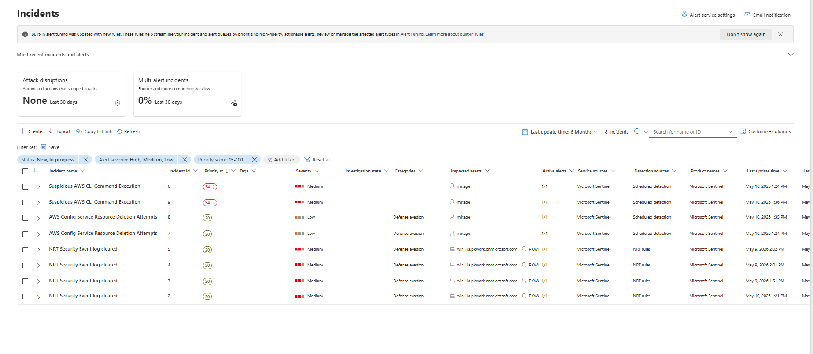
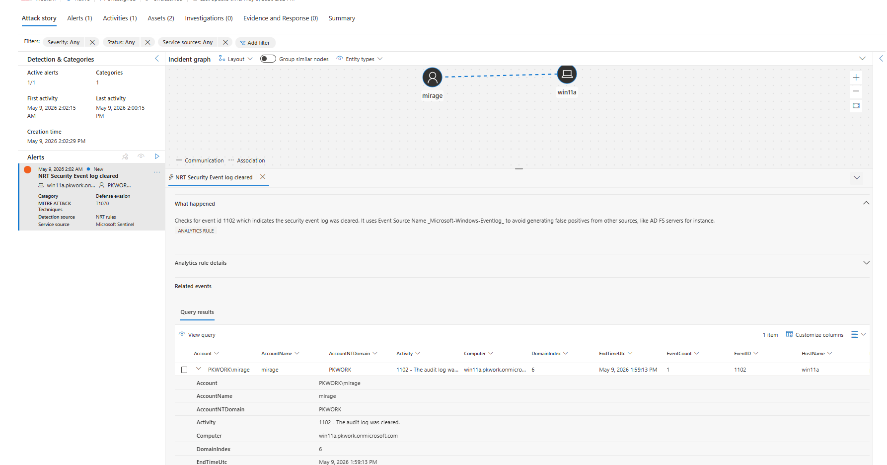

# Incident Response: End-to-End Investigation of Windows Security Log Clearing

**Platform:** Microsoft Sentinel · Defender XDR · Windows Security Events
**Domain:** Incident Response · Respond to security incidents
**Detection surface:** Microsoft Sentinel (Defender portal) — Incident queue · NRT analytics rule

---

## The problem — a real-world attack, not a hypothetical

When an attacker clears the security event log, they are not causing damage in that moment — they are **hiding damage already done**. Log clearing (Windows Event ID 1102) is one of the oldest and most reliable signals of an active intrusion, because legitimate users and processes almost never wipe the audit log. In the **2014 Sony Pictures** attack and across countless ransomware intrusions since, destroying or disabling logs was a standard step the attacker took to blind defenders and slow the response while they completed their objectives. [1][2]

The challenge this creates for an analyst is that the obvious fact — "a log was cleared" — is the *least* important part. The real questions are: *what was the attacker hiding, how far into the campaign are they, and how do I contain the right asset without destroying the remaining evidence?* Answering those correctly, in the right order, under time pressure, is the core of incident response.

## What this project is — and the skills it proves

This project is an **end-to-end incident investigation** in Microsoft Sentinel: triaging the queue, corroborating an alert against raw evidence, assessing true impact, and executing a full containment-and-response plan through the **PICERL** lifecycle. It demonstrates the judgement that separates reacting to an alert from investigating an incident — including recognising a multi-front campaign and matching containment to the specific compromised asset.

| Real-world failure | Capability this project builds |
|---|---|
| Analyst reacts to one ticket, missing the campaign | Queue-level triage that surfaces one actor across many incidents |
| Alert taken at face value | Corroboration against the raw `1102` event before acting |
| "A log was cleared" treated as the whole incident | Impact assessment focused on what the clearing *conceals* |
| Wrong containment applied to the wrong asset | Asset-specific response (isolate host ≠ revoke cloud identity) |

---

## Step 1 — Read the queue before opening anything

Before drilling into a single incident, I reviewed the whole queue. A pattern was immediately visible: the actor **`mirage`** appeared across almost every incident, spanning multiple systems:

- Suspicious AWS CLI command execution (cloud activity)
- AWS Config service resource deletion attempts (*Defense evasion* — deleting the service that records AWS changes)
- Security event log cleared, ×4 (*Defense evasion* — wiping Windows logs on `win11a`)

**Interpretation:** this is not a set of unrelated alerts — it is **one attacker's campaign** seen from multiple angles, with a clear theme of **evidence destruction** across both cloud (AWS Config deletion) and endpoint (Windows log clearing). Recognising the campaign at the queue level, before opening any incident, framed everything that followed.

I selected **Incident #5** (Active, host `win11a`, actor `PKWORK\mirage`) for full investigation.

---

## Step 2 — Understand the detection type

The incident was raised by an **NRT (Near-Real-Time)** rule, which runs roughly every minute — unlike a scheduled rule that may run hourly. This is the correct rule type for log clearing: when an attacker wipes the security log, the SOC needs to know immediately, not up to an hour later, because log clearing almost always signals an attacker actively covering their tracks.

---

## Step 3 — Establish entities and what happened

**Entities:** account `PKWORK\mirage`, host `win11a`.

**Alert:** the security event log on `win11a` was cleared at **1:59:13 PM on May 9, 2026**. Sentinel tagged the technique as **T1070 – Indicator Removal**.

---

## Step 4 — Corroborate with raw evidence

Rather than trusting the alert title, I confirmed it against the underlying event in the incident's *Related events* panel:

| Field | Value |
|---|---|
| EventID | **1102** |
| Activity | "1102 - The audit log was cleared." |
| Account | PKWORK\mirage |
| HostName | win11a |
| EndTimeUtc | May 9, 2026 1:59:13 PM |

This is the actual Windows log record, not the alert's description of it. The alert is therefore **corroborated by raw evidence** — Event ID 1102, on `win11a`, by `mirage`, at 1:59:13 PM.

Evidence is rarely labelled "evidence." It sits in a *Related events* / *Query results* panel, and the analyst must recognise that the row containing EventID 1102 with the actor's name *is* the proof. Verifying the alert against the raw event makes the verdict bulletproof.

**Verdict:** True positive, corroborated by raw evidence (Event ID 1102). High impact — evidence destruction indicating an active, mid-stage intrusion.

---

## Step 5 — Impact assessment

**High impact.** The significance of log clearing is not the act itself but **what it conceals**. Clearing the security log on `win11a` destroys local evidence of everything `mirage` did on that host beforehand, causing a **loss of visibility** for the investigator. Log clearing is rarely an attacker's first action — it typically occurs mid- or late-campaign, indicating an **active intrusion** rather than an early-stage probe.

**Key insight — centralised logging defeats local clearing:** `mirage` cleared the *local* Windows log on `win11a`, but that data was very likely already **forwarded to Sentinel** before the clearing. The endpoint logs are gone; the copies in the SIEM (`SecurityEvent`) remain. This is precisely why centralised logging exists, and it reframes the investigation: reconstruct the lost host activity from forwarded logs in Sentinel.

The open questions (backdoors, persistence, C2, credential theft, data exfiltration) become an **investigation plan**, not vague concern: hunt `win11a` for each of these to confirm or rule them out.

---

## Step 6 — Containment & response (host compromise)

**Critical distinction:** containment is **asset-specific**. The correct response to a compromised Windows *endpoint* is entirely different from the response to a compromised cloud *identity*. Cloud-identity actions (revoking OAuth grants, API tokens, Conditional Access) do not apply to a Windows log-clearing event — those belong to the separate cloud front of the same campaign.

**Response sequence for `win11a` (PICERL):**

1. **Isolate the host** (`win11a`) via Defender device isolation — cut it from the network to stop the bleeding. *This is done first* to prevent **lateral movement**: every second the host stays connected, the attacker can pivot to other machines or accounts. Isolation freezes the blast radius. (Defender's selective isolation keeps the agent connected, so the host can still be investigated remotely while the attacker is locked out.)
2. **Disable the account** (`mirage`) in AD — reset password, terminate active sessions.
3. **Preserve evidence** — pull forwarded logs from Sentinel (local logs are cleared); do not reboot or reimage yet.
4. **Hunt** — with host isolated and account disabled, investigate what the log clearing was meant to hide: persistence, backdoors, C2, credential theft, exfiltration.
5. **Eradicate** — remove *what the hunt finds* (specific backdoor/persistence), rotate any affected credentials.
6. **Recover** — once verified clean, restore the host to the network and normal operations.
7. **Cross-link containment** — ensure the *cloud identity* front of `mirage`'s campaign (API token / OAuth grants / Conditional Access) is contained in parallel, since it is the same actor operating on a second front.

**Precision note:** you *isolate a host* and *disable an account* — two different actions on two different objects. Isolation is a network-level action on a device; disabling is a credential-level action on an account.

---

## MITRE ATT&CK mapping

| Tactic | Technique | Evidence |
|---|---|---|
| Defense Evasion | T1070.001 – Indicator Removal: Clear Windows Event Logs | Event ID 1102 on `win11a` by `mirage` |

---

## Key design decisions

- **Triage the queue, not just the ticket.** The campaign theme — one actor, evidence destruction across cloud and endpoint — was visible only by reading the whole queue before opening any single incident.
- **Corroborate alerts with raw evidence.** The `1102` event in *Related events* turns "the alert says so" into "I verified it," making the verdict defensible.
- **Log clearing matters for what it hides.** Impact is assessed as loss of visibility and a likely active intrusion, not the clearing itself.
- **Centralised logging defeats local clearing.** Forwarded logs in the SIEM survive an attacker wiping the endpoint — which is how the investigation continues despite the local wipe.
- **Containment is asset-specific.** A compromised endpoint (isolate host + disable account) is contained differently from a compromised cloud identity (revoke tokens/OAuth). Reasoning from the current asset — not reciting a previous incident's steps — is the discipline.
- **Isolate first to prevent lateral movement.** Containing the spread takes priority over investigating detail while an attacker is live.
- **Correlate across incidents.** Same actor across multiple incidents = one campaign requiring containment on every front, in parallel.

---

## Future improvements

- **Reconstruct the hidden activity** — hunt the forwarded `SecurityEvent` and process telemetry for `win11a` across the window before 1:59:13 PM to establish what the log clearing was concealing.
- **Automate the first containment step** — a SOAR playbook that isolates the host and disables the account on a confirmed `1102` NRT alert, with the destructive steps gated behind analyst approval.
- **Timeline the full campaign** — correlate the Windows, AWS, and identity activity into a single chronological attack timeline to document the actor's complete path end to end.
- **Detection coverage review** — map which stages of this campaign were detected versus missed, and add rules to close the gaps (e.g. the activity the attacker cleared the logs to hide).

---

## Skills demonstrated

Incident triage · Queue-level campaign correlation · Alert corroboration with raw evidence · NRT vs. scheduled rule reasoning · Impact assessment · PICERL incident-response lifecycle · Asset-specific containment · Lateral-movement prevention · MITRE ATT&CK mapping

---

## References

1. CISA / FBI — [#StopRansomware guidance](https://www.cisa.gov/stopransomware) — log and backup destruction as a standard attacker step to impair recovery and response.
2. MITRE ATT&CK — [T1070.001: Indicator Removal — Clear Windows Event Logs](https://attack.mitre.org/techniques/T1070/001/) — adversary use of event-log clearing to evade detection.
